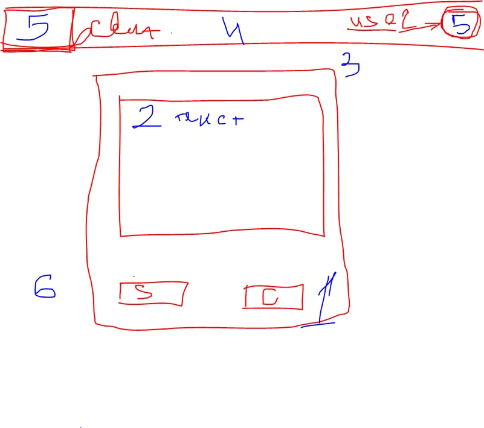
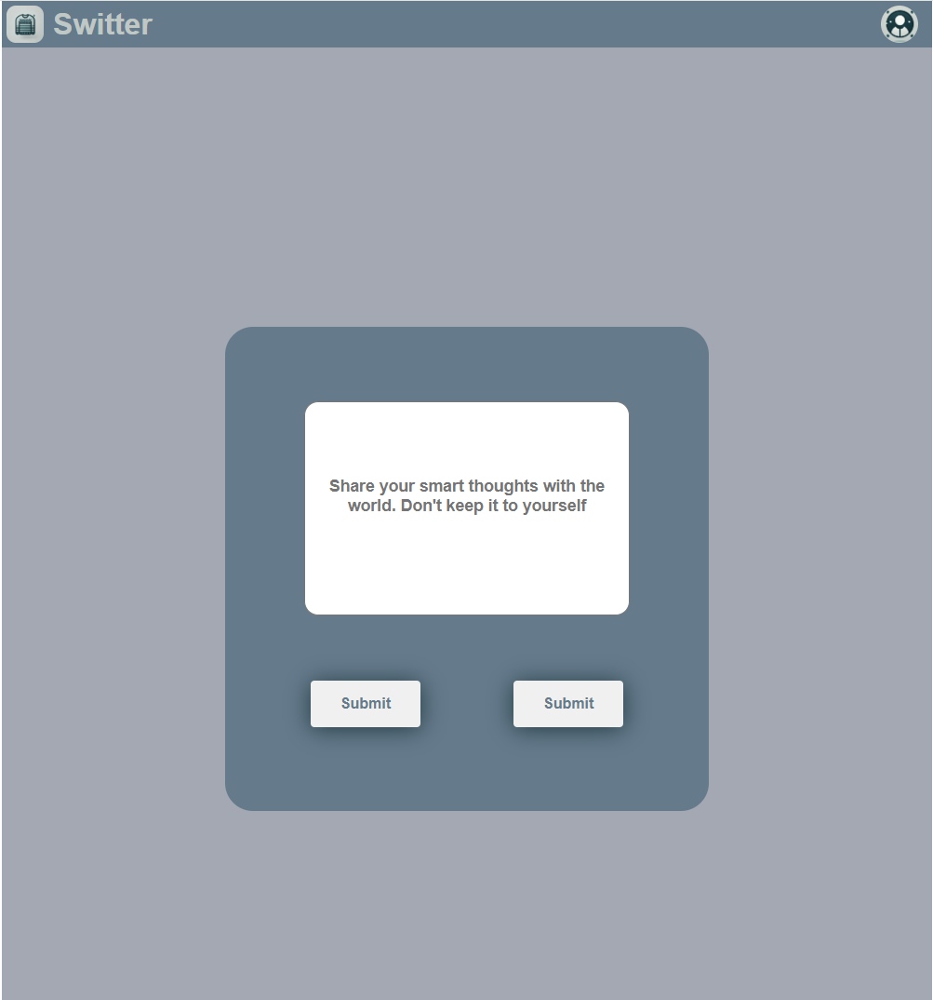

# Switter

## Task Description

1. Create two buttons, **Submit** and **Cancel**, that turn gray on hover.
2. Create a text input field with a limit of 200 characters. The default placeholder text should be: _"Share your smart thoughts with the world. Don't keep it to yourself."_
3. Center the buttons and the text input field on the screen.
4. Create a header within a `div` wrapper.
5. In the header, place:
   - A logo and the messenger name **Switter** on the left.
   - A round user profile picture on the right.
6. Set the background color of the page to gray.

### Layout Mockup

Here is the mockup provided by the instructor for reference:

### Screenshot of the Implementation

Here is a screenshot of the final implementation:

## Project Overview
This project is a simple web page layout designed to resemble a social network post page for **Switter**. It includes:

- A styled header with a logo and user profile picture.
- A central text input area where users can write their post, with a placeholder text and a character limit.
- Two interactive buttons, **Submit** and **Cancel**, that change color on hover.
- The layout is centered and responsive, with clean design elements and consistent styling across the page.

The page is built using **HTML** and **CSS**, and demonstrates the use of flexbox for alignment and positioning, along with basic CSS effects for hover interactions.

## Technologies Used

- **HTML5**
- **CSS3**
- **Flexbox**
